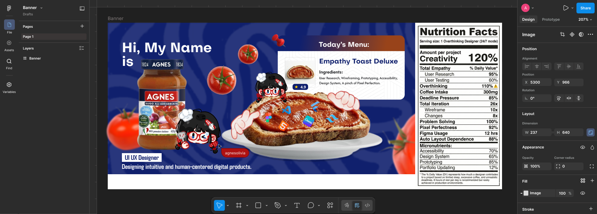
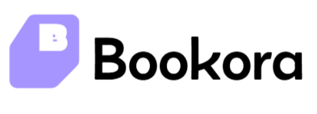

  <h1>Hi, I'm Agnes</h1>
  <h3>UI/UX Designer crafting intuitive digital experiences</h3>

---

###  About Me

I'm a passionate UI/UX Designer

-  I design user-centered digital products  
-  Focused on usability, clarity & accessibility  
-  Currently exploring advanced prototyping & design systems  

---

### What I Do

 •  Design user-centered digital experiences
 •  Transform complex ideas into intuitive interfaces
 •  Bridge design and development

---

## Featured Projects

| Icon | Project | Description | Tech Stack |
|------|---------|------------|------------|
|  | **RentalPartner** | Car rental management system with booking flow, user & owner dashboard | Laravel, Tailwind CSS |
|  | **Bookora** | Book discovery and search platform | Flask, HTML, Figma |
|  | **PetPartner** | Mobile application for pet care services and needs | Flutter, Figma |
|  | **AIMS** | Academic management system for tutoring center (IEC Jemadi) | Laravel, MySQL, Tailwind CSS, Figma |

### Fun Fact:

 •  I love cats
 •  Once coded for an entire day non-stop
 •  Surprisingly good at forgetting small things

---
<!--
**agnesolivia/agnesolivia** is a ✨ _special_ ✨ repository because its `README.md` (this file) appears on your GitHub profile.
-->

###

###

