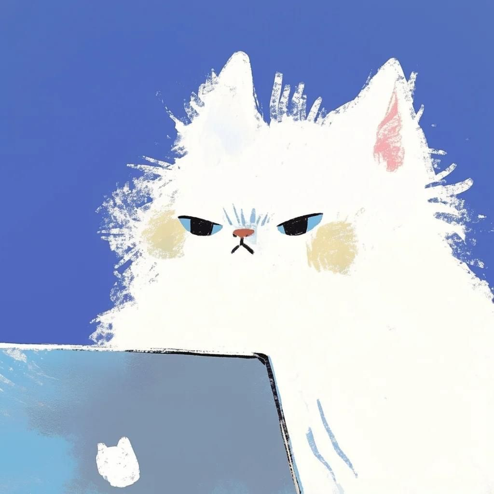

  <h1>👋Hi, I'm Agnes👋</h1>
  <h3>UI/UX Designer crafting intuitive digital experiences</h3>
  
  

  

  

  

---

###  💧About Me
> [!NOTE]
> A UI/UX enthusiast and developer who enjoys turning ideas into intuitive and functional digital products. I design user-centered interfaces and bring them to life through modern web and mobile technologies. Passionate about crafting seamless experiences, I continuously explore better ways to combine design thinking with scalable development.

---

### 💧Tech Stack

  

### 💧What I Do

 -  Design user-centered digital experiences
 -  Transform complex ideas into intuitive interfaces
 -  Bridge design and development

---

## 💧Featured Projects

| Icon | Project | Description | Tech Stack |
|------|---------|------------|------------|
|  | **RentalPartner** | Car rental management system with booking flow, user & owner dashboard | Laravel, Tailwind CSS |
|  | **Bookora** | Book discovery and search platform | Flask, HTML, Figma |
|  | **PetPartner** | Mobile application for pet care services and needs | Flutter, Figma |
|  | **AIMS** | Academic management system for tutoring center (IEC Jemadi) | Laravel, MySQL, Tailwind CSS, Figma |

---

### 💧Fun Fact:

     

 •  I love cats
 •  Once coded for an entire day non-stop
 •  Surprisingly good at forgetting small things

---

### 💧Github Analytics

  

    
    

